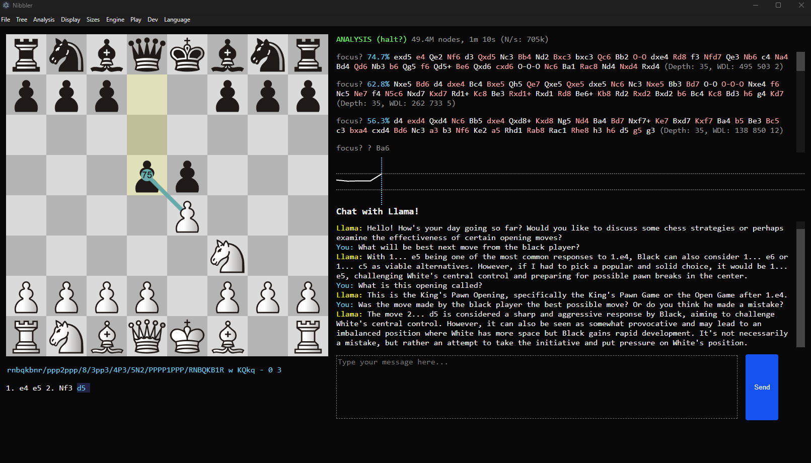

# Chess Engine with AI Tutor

This is an AI-powered chess tutoring application to help players learn more efficiently. The project integrates real-time chess analysis via [Nibbler](https://github.com/rooklift/nibbler) and the [Stockfish chess engine](https://stockfishchess.org/), along with Ollama-hosted language model to answer chess-related questions in context. 

The chatbot is constrained through prompt engineering to respond only to chess-related questions and is continuously provided with the current game state via system prompts.

For setup and configuration details, refer to the documenatation for:
- [Nibbler](https://github.com/rooklift/nibbler)
- [Stockfish chess engine](https://stockfishchess.org/)
- [Ollama documentations](https://docs.ollama.com/)

The following tools/packages are being used:
| Tool             | Version |
|------------------|---------|
| Ollama           | 0.6.5   |
| Nibbler          | 2.5.1   |
| Stockfish Engine | 17.1    |
| Llama            | 3.1     |

